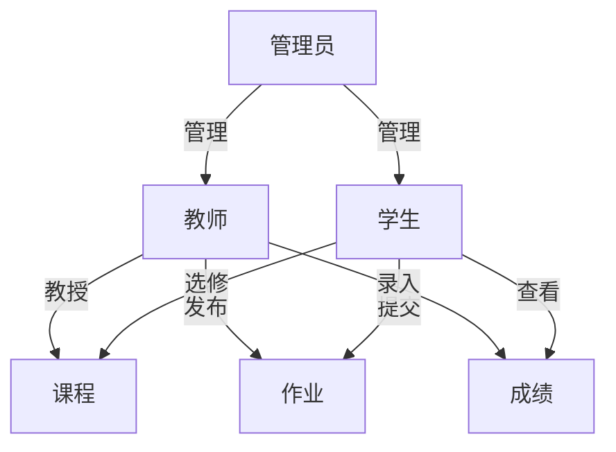
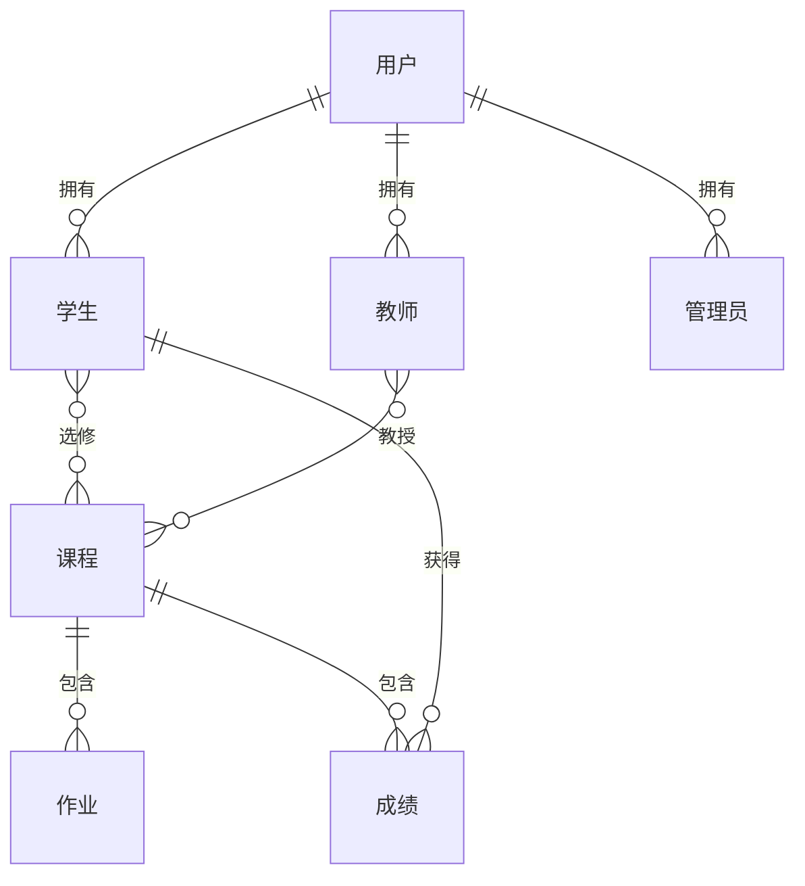

```mermaid
graph TD
    A[管理员] -->|管理| B[教师]
    A -->|管理| C[学生]
    B -->|教授| D[课程]
    C -->|选修| D
    B -->|发布| E[作业]
    C -->|提交| E
    B -->|录入| F[成绩]
    C -->|查看| F
```

```mermaid
erDiagram
    用户 ||--o{ 学生 : "拥有"
    用户 ||--o{ 教师 : "拥有"
    用户 ||--o{ 管理员 : "拥有"
    学生 }o--o{ 课程 : "选修"
    教师 }o--o{ 课程 : "教授"
    课程 ||--o{ 作业 : "包含"
    课程 ||--o{ 成绩 : "包含"
    学生 ||--o{ 成绩 : "获得"
```
