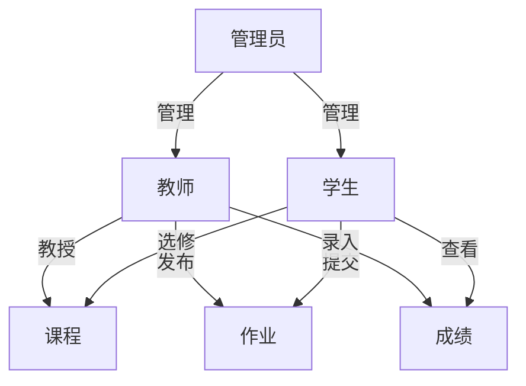
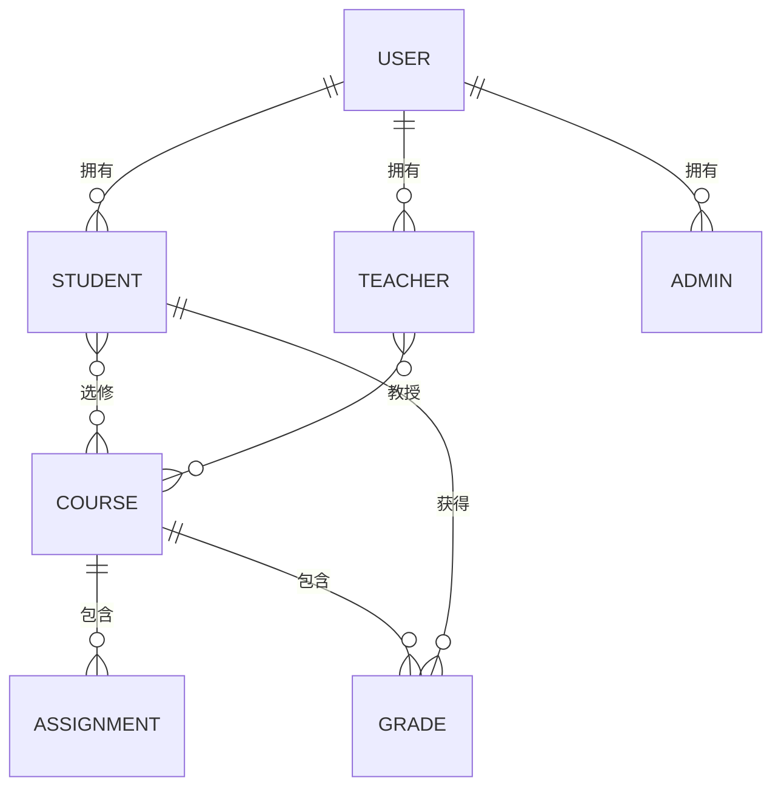

```mermaid
graph TD
    A[管理员] -->|管理| B[教师]
    A -->|管理| C[学生]
    B -->|教授| D[课程]
    C -->|选修| D
    B -->|发布| E[作业]
    C -->|提交| E
    B -->|录入| F[成绩]
    C -->|查看| F
```

```mermaid
erDiagram
    USER ||--o{ STUDENT : "拥有"
    USER ||--o{ TEACHER : "拥有"
    USER ||--o{ ADMIN : "拥有"
    STUDENT }o--o{ COURSE : "选修"
    TEACHER }o--o{ COURSE : "教授"
    COURSE ||--o{ ASSIGNMENT : "包含"
    COURSE ||--o{ GRADE : "包含"
    STUDENT ||--o{ GRADE : "获得"
```